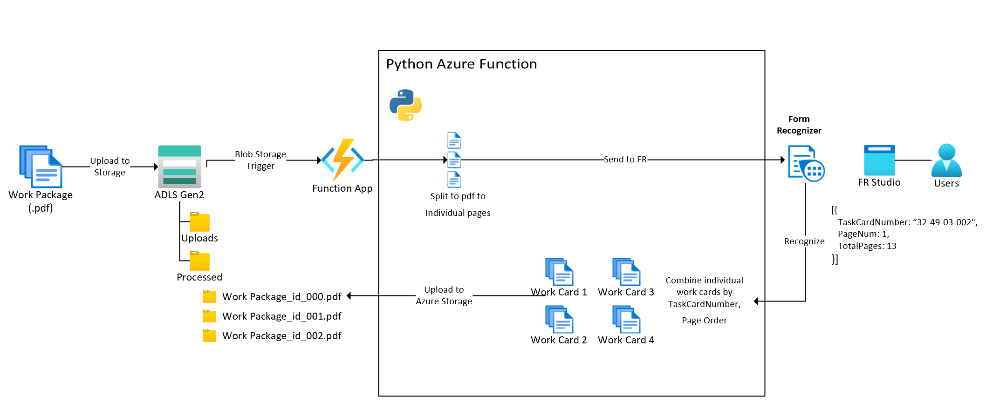

# Splitting large PDF documents and recombining based on a form ID using Azure Form Recognizer
This solution demonstrates how Azure Functions can be used to split large PDF files into individual pages, extract their information using Azure Form recognizer, and then recombine the documents based on an extracted form ID. 

## Deploying this sample
The easiest way to deploy this sample is to 
1. Deploy the following azure resources:
    1. Azure Form Recognizer instance
        * After creating this form, follow the instructions here to train a model based on individual form pages [Get started: Form Recognizer Studio](https://docs.microsoft.com/en-us/azure/applied-ai-services/form-recognizer/quickstarts/try-v3-form-recognizer-studio#custom-models)
        * make sure to capture a document ID on each sample document. 
        * make a note of the model id during training.
    2. Azure Functions instance (consumption mode is okay)
    3. Azure Storage Account with hierarchichal namespace enabled (i.e. ADLS Gen 2). 
        * After deployment create a container. In that container, create a folder called "uploads" and another called "processed".
1. Follow the environment configuration instructions in [this Azure Functions quickstart](https://docs.microsoft.com/en-us/azure/azure-functions/create-first-function-vs-code-python#configure-your-environment)
1. Clone this repository to your local machine. 
1. Open the repository in Azure Functions.
1. Rename the local.settings_sample.json file to => local.settings.json in the project directory. 
1. Update the values in the local.settings_sample.json to match your storage account and form recognizer details. 
1. Update the "binding" definition for the function. 
    * This is what triggers the function to run. 
    * Open the "function.json" file in the SplitWorkPackageAsync directory. 
    * Update the path in this file to match your container name and the uploads folder created. i.e. "path": "your_container_name/uploads/{filename}",
1. Run the function locally to test. 
1. Deploy the app by
    1. Opening the VS code command pallette (Ctrl+Shift+P/Cmd+Shift+P)
    1. Type and select "Azure Functions: Deploy to Function App"
    1. Browse to select the "azfunc" folder in this repository. 
    1. Choose "Create new Function App in Azure"
    1. Enter a globally unqiue name for the function app. 
    1. Choose the runtime stack Python 3.9
    1. Select the target region for your deployment.
1. You can also follow the [instructions for functions deployment here](https://docs.microsoft.com/en-us/azure/azure-functions/create-first-function-vs-code-python#publish-the-project-to-azure)

## Test the function
If there aren't any missed steps, you should be able to trigger this function by uploading a multi-page PDF to the "uploads" folder in your Azure storage. 

## Additional Resources:
Check out these links for more information about this solution
* [Azure Functions Python developer guide](https://docs.microsoft.com/en-us/azure/azure-functions/functions-reference-python?tabs=asgi%2Cazurecli-linux%2Capplication-level)